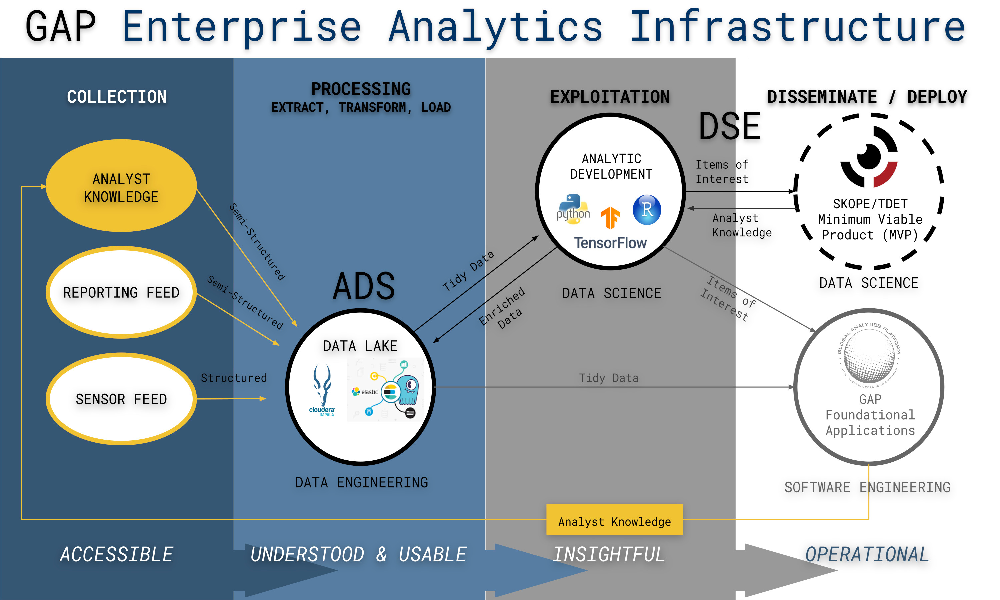

<script type="text/javascript">
    var SLIDE_CONFIG = {
      // Slide settings
      settings: {
                title: 'Decisive Point',
                        subtitle: 'Defense Venture Fellowship Capstone',
                useBuilds: true,
        usePrettify: true,
        enableSlideAreas: true,
        enableTouch: true,
                        favIcon: 'assets/images/shift_logo.png',
              },

      // Author information
      presenters: [
            {
        name:  'MAJ Gabe Samudio' ,
        company: '',
        gplus: '',
        twitter: '',
        www: '',
        github: ''
      },
            ]
    };
</script>


```{r setup, include=FALSE}
library(knitr)
knitr::opts_chunk$set(echo = FALSE)
library(plotly)
library(iheatmapr)
library(visNetwork) 
library(SKOPEdocumenteR)
```
## SKOPE Slide Template

- These slides provide an overview that demonstrate several features
- Use background slides
- Present bullets incrementally
- Embed graphics

### Notes
- Once you generate the markdown file there are several useful GAP/Skope graphics in directory 'assets/images'
- If you are operating on a windows operating system change line 16 to '- assets/static/custom_windows.css' 

### Note: when you generate the slide deck there is a directory with useful graphics files at 'assets/images/' 

## Analytic Aimpoints

<div class="portion-mark-top">
UNCLASSIFIED
</div>

<div class="portion-mark-bottom">
UNCLASSIFIED
</div>

"We need to get to a place where our leaders care about data the same way they care about ammunition." GEN Austin Miller

### Responsive
 - able to extract insights at operational speed

### Relevant
 - able to deliver mission value and drive outcomes

### Rigorous
 - thorough, exhaustive, and accurate

### Reusable
 - consumable for other problems and by other practitioners


## Using smaller text and background images{.smaller data-background=assets/images/platformImage_background.jpg data-background-size=cover}

<div class="portion-mark-top">
UNCLASSIFIED
</div>

<div class="portion-mark-bottom">
UNCLASSIFIED
</div>

"Data in the 21st Century is like Oil in the 18th Century: an immensely, untapped valuable asset. Like oil, for those who see Data’s fundamental value and learn to extract and use it there will be huge rewards." 

["Data is the New Oil"](https://www.wired.com/insights/2014/07/data-new-oil-digital-economy/)

**Joris Toonders**, WIRED 2014

<br/ >

"More often than not, companies are not ready for AI. Maybe they hired their first data scientist to less-than-stellar outcomes, or maybe data literacy is not central to their culture. But the most common scenario is that they have not yet built the infrastructure to implement (and reap the benefits of) the most basic data science algorithms and operations, much less machine learning."


["The AI Hierarchy of Needs"](https://medium.com/hackernoon/the-ai-hierarchy-of-needs-18f111fcc007)

**Monica Rogati**, Medium 2017

## Interactive Plot Example

<div class="portion-mark-top">
UNCLASSIFIED
</div>

<div class="portion-mark-bottom">
UNCLASSIFIED
</div>

```{r, out.width = 800 ,echo=FALSE}
# Small fig.width
library(iheatmapr)
data(measles, package = "iheatmapr")

main_heatmap(measles, name = "Measles<br>Cases", x_categorical = FALSE,
             layout = list(font = list(size = 8))) %>%
  add_col_groups(ifelse(1930:2001 < 1961,"No","Yes"),
                 side = "bottom", name = "Vaccine<br>Introduced?",
                 title = "Vaccine?",
                 colors = c("lightgray","blue")) %>%
  add_col_labels(ticktext = seq(1930,2000,10),font = list(size = 8)) %>%
  add_row_labels(size = 0.3,font = list(size = 6)) %>% 
  add_col_summary(layout = list(title = "Average<br>across<br>states"),
                  yname = "summary")  %>%                 
  add_col_title("Measles Cases from 1930 to 2001", side= "top") %>%
  add_row_summary(groups = TRUE, 
                  type = "bar",
                  layout = list(title = "Average<br>per<br>year",
                                font = list(size = 8)))
```


## Two Column Layout{.smaller}

<div class="portion-mark-top">
UNCLASSIFIED
</div>

<div class="portion-mark-bottom">
UNCLASSIFIED
</div>

<div class="columns-2">

### Analytic Support 

<br/>

### Enterprise Data 
- ADS: Industry caliber data lake

### Enterprise Tools 

- [DSE](https://skope-jhub.itss.forcenex.us/user/lab?): Secure, server-side R/Python/Zeppelin environments
- [JTTP](https://gitlab.master.forcenex.us/gap/skope?nav_source=navbar): Shared, robust, documented R and Python libraries

### Tradecraft
 - [KnowledgeHub](https://skopeknowledgehub-devel.itss.forcenex.us/): shared content to grow the community and push best practices horizontally

<br/>



</div>
